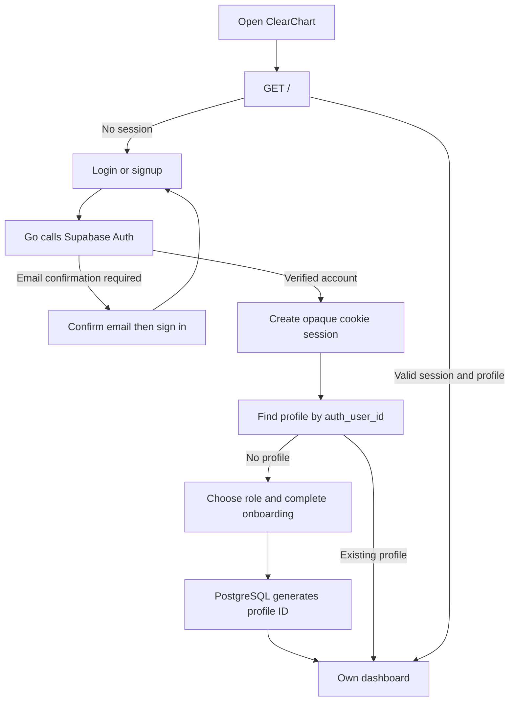

> Repository cleanup: the automated test suite and in-memory fixtures have been removed. Scan rendering was moved into handlers.go to preserve existing database image URLs. Historical test results below describe verification before cleanup; current checks are go build and go vet.

# ClearChart maintainer handoff

Work in **D:\projects\ClearChart**. The older `hackkathon` directory is a different copy. This page and [authentication.md](authentication.md) describe the current database-backed, authenticated application.

## Start at main()

```text
main()
  load .env if present; process environment takes precedence
  require DATABASE_URL and Supabase Auth configuration
  NewPostgresStore() -> open pool -> ping
  configure Supabase Auth HTTP client
  newApp() -> parse embedded templates -> session map -> event hub
  routes() -> register handlers
  ListenAndServe() -> handle browser requests
```

The non-test Go files form one `package main`. `go run .` compiles the whole application; `_test.go` files do not enter the running server. Templates and static assets are embedded at build time, so edits require a rebuild/restart. A template parse error stops startup.

PostgreSQL is the only runtime store. Missing configuration or a failed database connection stops startup. The application does not seed or migrate the database automatically. Sessions and live notifications still live in the Go process; restarting it preserves database records but requires users to sign in again.

## Entry, identity, and onboarding



The browser submits login/signup as ordinary HTML POST forms so the server can redirect without custom JavaScript. Passwords go from Go to Supabase Auth. The application session identifies the verified Auth user; profile ownership is found through `profiles.auth_user_id`, not a posted email or chosen dashboard ID.

Authenticated users without a profile see onboarding. The backend takes the account email and Auth ID from the verified session. Role-specific fields become a `Profile`, which `Store.CreateProfile` saves with a database-generated row ID. It does not assign a care team automatically. Onboarding retains Datastar SSE feedback and a link into the created workspace.

`/demo/...` is gone. One browser cookie represents one signed-in account. Use a separate browser profile or private window when testing patient and doctor accounts at the same time. See [authentication.md](authentication.md) for configuration, migration, session lifetime, and explicit test-data linking.

## Dashboard assembly

`dashboard()` verifies the session and requested profile ID, then `dashboardData()` builds a `Dashboard` view model:

- `Profile` is the signed-in person. `Patient` is the selected chart; these are different for doctors.
- Doctors receive only patients linked through `care_team`, those patients' report filenames, and their own sample biometric data if present.
- Patients can read their own chart. A request parameter cannot make another patient their identity.
- The selected chart includes records, uploads, care-team providers, healing values, counts, and a rule-based summary.

`render()` executes an HTML template with contextual escaping; `page()` sends the completed document. Keep interpolation escaped and keep relationship checks in the server and store when extending an operation.

## Data updates and Datastar

```text
doctor-record-form -> @post('/add-record', {contentType: 'form'})
  parse and validate -> session + CSRF + care-team checks
  Store.AddRecord() -> PostgreSQL insert -> saved row returned
  render record -> SSE prepend to #timeline -> counts + feedback
  hub.publish(patientID, viewID)
    other tabs' GET /events/... streams wake
      reload authorized data -> snapshot fragments -> Datastar morphs DOM
```

The POST response is short-lived SSE. The dashboard also keeps a separate long-lived GET SSE connection. User actions travel browser-to-server over HTTP; HTML updates travel server-to-browser over SSE. The hub carries a notification, not the record. A periodic refresh also reloads relevant data.

`view_id` avoids echoing the author's change straight back to the same tab; it is not an access token. The hub and cookie sessions are process-local, so a second server does not automatically share them.

A patient upload validates the selected filename/type/size, discards file bytes, and stores only metadata. Healing check-ins save a 1?10 score and patch the graph. These remain deliberate prototype behaviors even with a real database.

## Preserve patient scrolling

The doctor's patient click changes `$selectedpatient`. A Datastar effect opens a stable `/events/doctor/...` URL with the selected ID in its signal payload. The server validates the care-team relationship and updates the selected patient card, form, timeline, and supporting panels.

The stream does not replace `#patient-directory` or the page shell, so scrolling survives. Each chart form has patient-specific IDs; changing patients discards the old draft instead of morphing it into another chart. Selection is gated during saving, and the previous form stays disabled until the new chart arrives. Regular refreshes leave the note form intact.

Preserve these constraints when changing templates. Browser history is not updated by selection: refresh falls back to the URL's patient parameter or the first linked patient.

## Where to work

| Area | Files | Purpose |
| --- | --- | --- |
| Startup and routing | `main.go` | Configuration, embedded assets, HTTP server, shared app state. |
| Authentication | `auth.go`, `supabase_auth.go`, `templates/auth.html` | Supabase Auth requests, login/signup/logout, application sessions. |
| Profile and care actions | `handlers.go` | Dashboard assembly, onboarding, records, report metadata, check-ins. |
| Data contracts | `models.go` | Structs and the Store interface used by handlers and tests. |
| Persistent storage | `store.go`, `schema.sql`, `migrations/` | lib/pq queries, database constraints, explicit schema upgrades. |
| Live updates | `live.go` | Notification subscriptions, authorized snapshots, SSE encoding. |
| Presentation | `templates/`, `static/` | Go templates, Datastar attributes, styling and images. |
| Synthetic scan rendering | `handlers.go` | Existing seeded image URLs; keep while those rows are used. |
| Optional database fixtures | `seed.sql`, `seed_large.sql` | Repeatable synthetic rows, never loaded automatically. |

For a new operation, follow the sequence of authenticate, authorize, validate, store, render, and publish. Adding a model field usually also needs a migration, query/scan changes, validation, templates, and meaningful regression coverage.

## Run and verify

```powershell
Set-Location D:\projects\ClearChart
go mod download
go test ./...
go vet ./...
go run .
```

Use the installed Go toolchain. If its default cache misbehaves, set `$env:GOCACHE = "$PWD\.tools\go-cache"` in that shell. The server reads `.env` and environment variables; deployed environment variables take precedence. [Authentication setup](authentication.md) lists the required settings and existing-database migration.

Go tests use test fixtures, not your live Supabase data. Optional integration tests create an isolated database on an explicitly configured local PostgreSQL instance. After deploying, test with your own accounts: sign up, confirm email, onboard, assign a deliberate care relationship, post a note, observe another browser, and verify the saved record remains after restart.

Build the executable with `go build -o clearchart.exe .`. Deploy the binary, runtime configuration, and separately applied database migrations. Source, docs, tests, caches, and SQL fixture scripts are not needed beside the executable. Configure HTTPS/proxy streaming for SSE; set `COOKIE_SECURE=true` when HTTPS terminates at the proxy. Cookie sessions currently require another login after server restart or expiration.

## Cleanup and earlier references

The runtime demo entry points and memory seed code are removed. Test fixtures are intentionally kept. Existing seeded database content is preserved. Keep scan rendering and referenced static images; deleting those breaks stored image URLs. Keep SQL seed scripts if you want repeatable database tests; they have no runtime effect.

`.tools/` contains ignored local caches and browser/test artifacts. It may also contain a temporary PostgreSQL server/data directory: stop that helper before deleting its files. Do not delete `.env`, `go.mod`, `go.sum`, embedded assets, or runtime source as cleanup.

The following references predate the authentication migration. They remain useful for unchanged storage, rendering, and live-update details, but their demo startup/login/fixture instructions are historical. Use this page, [authentication.md](authentication.md), and source code for the current behavior:

- [Runtime function reference](runtime-reference.md)
- [Storage/database reference](storage-database.md)
- [Templates, tests, and cleanup reference](templates-tests-cleanup.md)
- [Earlier XML/SVG diagrams](diagrams.md)
- [Symbol index](symbol-index.md)

A context note for another developer:

> Work in D:\projects\ClearChart. It is Go net/http + html/template + Datastar v1.0.3 with no custom frontend JavaScript. PostgreSQL is required; .env is supported. Supabase Auth supplies verified identity, profiles.auth_user_id links the application profile, and onboarding never auto-links care teams. Runtime demo routes and memory seeding are gone; fixtures are test-only. Preserve server authorization, filename-only disclosures, the stable patient directory and stream URL, patient-specific form IDs, and SSE behavior. Read docs/authentication.md before changing sessions or configuring test accounts.
