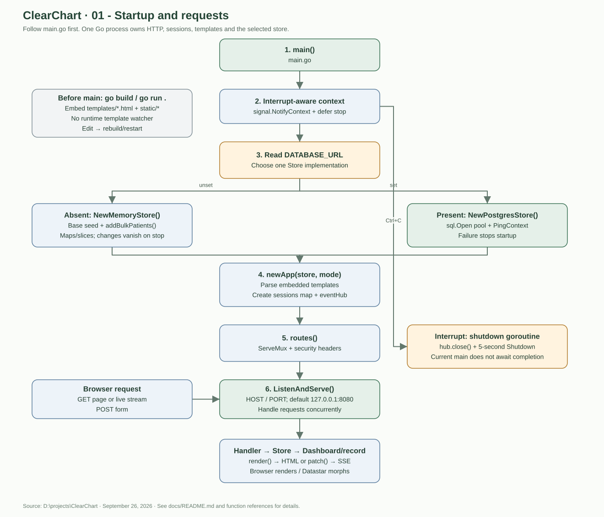
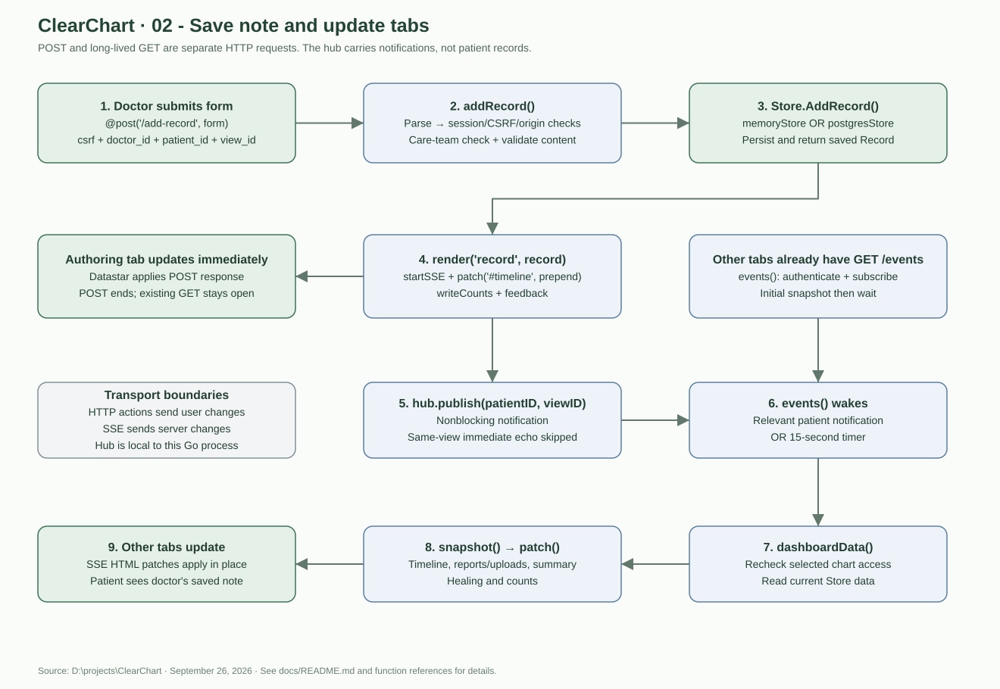
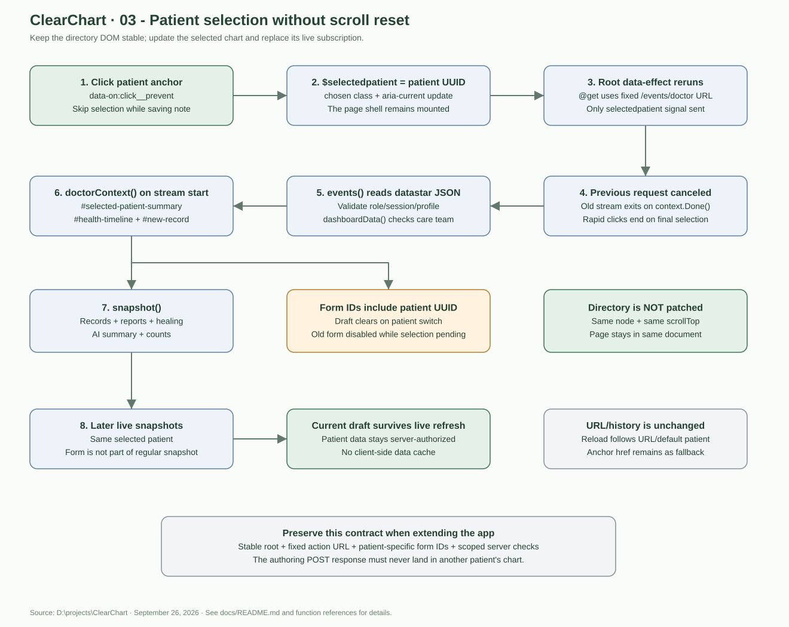
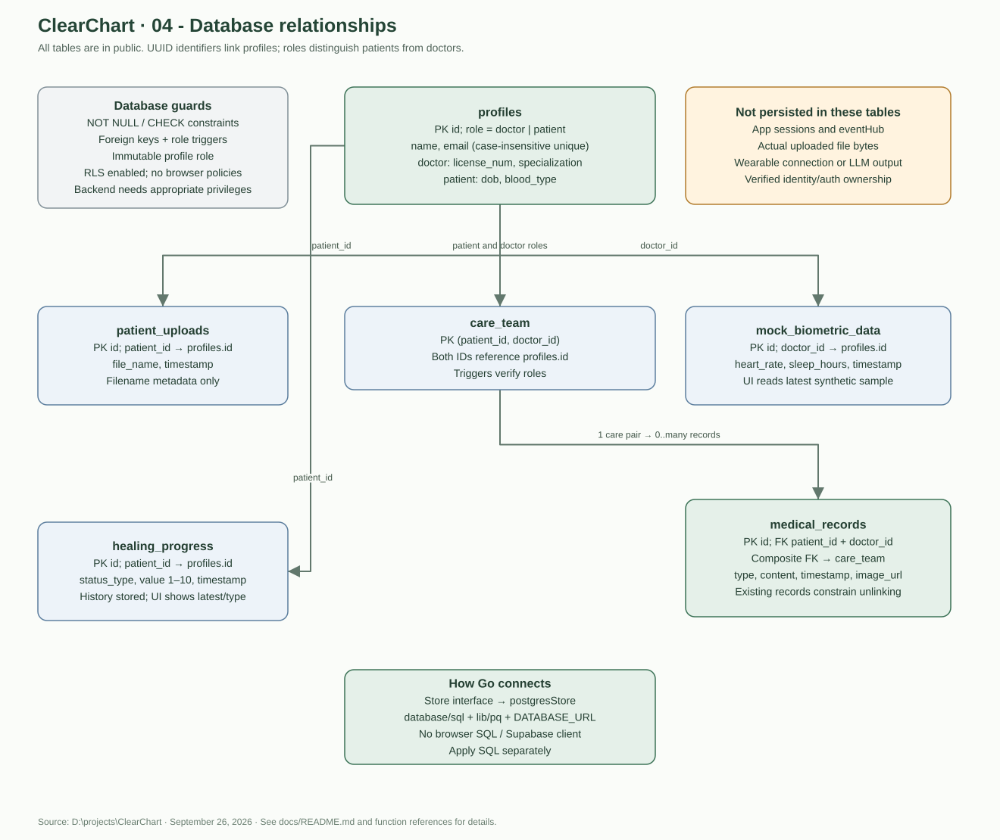

# ClearChart diagrams

[Back to handoff](README.md)

The editable [architecture.drawio](architecture.drawio) contains four pages of uncompressed XML. Open it with draw.io Desktop, or use File → Open From → Device in the diagrams.net editor. The .drawio extension is the editor's XML format; see [the format documentation](https://www.drawio.com/docs/manual/editor/save-file-formats/).

The SVG previews below work directly in a browser without the editor or an internet connection. They show flow and relationships, not every implementation detail; the code references explain each function.

## 1. Startup and requests — begin at main()

Follow main → context → DATABASE_URL → store → newApp → routes → ListenAndServe. The request handler runs only when a matching request arrives. Both stores share the same handler/template layer. Embedded assets are fixed at build time.

## 2. Saving a note and updating other tabs

The POST writes first, sends fragments to its caller, and publishes a notification. Other tabs' existing GET streams reload authorized data and send their own fragments. The hub is in-process; PostgreSQL does not automatically distribute notifications or sessions.

## 3. Switching patients without resetting scroll

The selected signal changes the stream's payload while the action URL remains stable. Only chart fragments change. The server repeats authorization; a signal is not an access grant. New-patient form IDs prevent old drafts following the doctor across charts. Later snapshots preserve the current form.

## 4. Database relationships

Each database relationship edge points from a referenced table to a dependent table. `medical_records` has individual profile foreign keys **and** the composite care-team foreign key; the diagram emphasizes the composite relationship. Patient/doctor roles are enforced for care pairs and other role-specific references by SQL triggers. A profile can have zero or many records/uploads/check-ins; a care pair can have zero or many records.

`Dashboard` is a Go view model, not a table. `DoctorName`/`PatientName` are display fields supplied by queries, not duplicated medical-record columns. `mock_biometric_data.id` exists in SQL even though the displayed `Biometric` Go struct does not retain it.

See [storage-database.md](storage-database.md) for every column, check, index, trigger, query method, and migration instruction.
