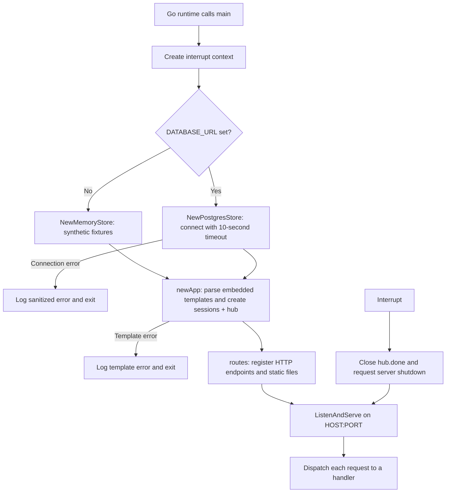
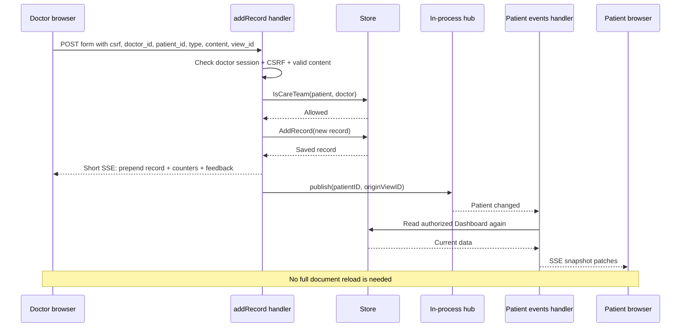

# ClearChart runtime reference

[Start here: project handoff and reading order](README.md) · [Editable architecture diagram](architecture.drawio) · [Architecture overview](architecture.svg)

This guide describes the code saved in `D:\projects\ClearChart`, concentrating on [main.go](../main.go), [handlers.go](../handlers.go), and [live.go](../live.go). Read it in order to follow the program from `main()` to a browser update. The separate model, storage, template, and database references explain the components these runtime files call.

The application is a Go HTTP server. It renders HTML on the server and sends small HTML updates through Datastar Server-Sent Events (SSE). The `Store` interface lets the same handlers use either an in-memory demonstration database or PostgreSQL. Choosing PostgreSQL makes the stored data persistent; it does **not** replace the demonstration login mechanism with real authentication.

## How to read the Go signatures

- `func main()` is a standalone function. Go calls this entry point when the program starts.
- `func (a *app) dashboard(...)` is a method on `app`. The receiver `a` gives that method access to the shared store, templates, sessions, and event hub.
- `http.ResponseWriter` is where the server writes response headers and the response body. `*http.Request` contains the URL, method, headers, cookies, body, and cancellation context.
- `context.Context` carries cancellation and deadlines. Store operations receive the request context so a canceled request can also cancel database work.
- `(Dashboard, error)` means a function returns both data and an error. Callers must check the error before trusting the data.
- A pointer such as `*eventHub` shares the underlying object. A slice such as `[]Record` is a sequence. A map is a keyed lookup table. A channel transports values between goroutines.

## 1. Start at `main()`

### `func main()` — [main.go](../main.go)

**Called by:** the Go runtime. **Purpose:** construct the application, listen for requests, and shut down on an interrupt.

Its execution order is:

1. `signal.NotifyContext(context.Background(), os.Interrupt)` creates a context that is canceled when the process receives an interrupt, such as Ctrl+C. `defer stop()` releases signal resources when `main` returns.
2. It declares `var store Store`. `Store` is the common interface implemented by the memory and PostgreSQL backends.
3. It reads `DATABASE_URL` from the **process environment**. This code does not read a `.env` file automatically.
4. If `DATABASE_URL` is nonempty, it allows up to 10 seconds for `NewPostgresStore(connectCtx, dsn)` to connect. Failure stops startup; it does not quietly fall back to memory. The log message deliberately avoids including credentials. The visible mode becomes `Supabase connected`, although the constructor is a PostgreSQL connection and is not inherently limited to Supabase.
5. Without `DATABASE_URL`, it calls `NewMemoryStore()` and uses `Demo mode`. This mode loses mutations when the process exits.
6. `defer store.Close()` arranges normal cleanup of the selected store.
7. `newApp(store, mode)` parses templates and constructs shared runtime state. A template parse error stops startup before the server starts listening. This is why a malformed `{{...}}` expression can produce a line-numbered error immediately on `go run .`.
8. It reads `PORT`, defaulting to `8080`, and `HOST`, defaulting to `127.0.0.1`. `net.JoinHostPort` constructs a correctly formatted listening address, including support for IPv6 host syntax.
9. It creates `http.Server` with `a.routes()` as its handler. Request headers have a 5-second read timeout, idle HTTP connections have a 60-second timeout, and headers have a 1 MiB limit. There is no global `WriteTimeout`, which avoids cutting off the deliberately long SSE responses; `writeStream` instead bounds individual SSE writes.
10. A goroutine waits for the interrupt context. On cancellation it calls `a.hub.close()` to ask live streams to finish, then gives `srv.Shutdown` up to 5 seconds to stop accepting new work and let active handlers finish.
11. It logs the address and calls `srv.ListenAndServe()`. This blocks while the server runs. `http.ErrServerClosed` is expected during shutdown; other listening errors stop the process. For example, an occupied port produces the address-in-use error.

**Maintenance implications:** `ListenAndServe` is plain HTTP; this code does not provision TLS certificates. A deployment can put a correctly configured HTTPS reverse proxy in front of it. `HOST=0.0.0.0` exposes the listener on available interfaces, which is often needed in a container; the default loopback binding is suitable for local development. The shutdown handler currently watches `os.Interrupt`, not an explicitly registered Unix `SIGTERM`. Also, `Shutdown` runs in a goroutine: `main` does not explicitly wait for that goroutine to finish after `ListenAndServe` returns. For a deployment that needs guaranteed request draining, complete and await the shutdown sequence before returning from `main`. `log.Fatal` calls `os.Exit`, so deferred cleanup does not run on fatal startup/listener errors.



### Package-level asset declaration

`//go:embed templates/*.html static/*` tells the compiler to put the matching files inside the executable. `var assets embed.FS` holds that read-only embedded filesystem.

This is why the compiled program can serve its CSS and templates without opening loose files at request time. Template changes take effect after rebuilding/restarting, not by refreshing the browser alone. `go run .` rebuilds the package; an already running process still has its previous embedded copy. SQL files, documentation, and `.tools` are not embedded by this declaration.

### `session` struct

| Field | Type | Meaning and reason it exists |
|---|---|---|
| `ProfileID` | `string` | Identifies the signed-in demo profile. Used to prevent a cookie for one profile from opening another profile's dashboard path or submitting as another user. |
| `Role` | `string` | `doctor` or `patient`. Keeps each role's cookie/session separate and selects permissions. |
| `CSRF` | `string` | Random value placed in the rendered form and compared with the server-side session during POSTs. It is separate from the session cookie token. |
| `Expires` | `time.Time` | Server-side session expiration, set to 12 hours after creation. |

The browser does not receive this struct. It receives a random cookie token that acts as a lookup key into `app.sessions`.

### `app` struct

| Field | Type | Meaning and reason it exists |
|---|---|---|
| `store` | `Store` | The selected backend for profiles, records, uploads, care relationships, healing, and biometric data. All handlers use this abstraction. |
| `templates` | `*template.Template` | The compiled collection of all named Go HTML templates, parsed once at startup. |
| `mode` | `string` | A display label such as `Demo mode` or `Supabase connected`. This is not an authorization mode. |
| `mu` | `sync.Mutex` | Protects concurrent access to the session map. It does not lock the entire application or replace the store's own concurrency controls. |
| `sessions` | `map[string]session` | Maps opaque cookie tokens to session details in this process's memory. |
| `hub` | `*eventHub` | Publishes “this patient's data changed” notifications to open live connections in this process. |

Keeping dependencies in one `app` value lets handlers share a store without package-wide mutable database globals. It also lets tests construct an application with a fresh memory store.

### `func newApp(store Store, mode string) (*app, error)`

**Called by:** `main`, and test setup. **Calls:** `template.New`, `Funcs`, `ParseFS`, `newEventHub`.

It registers the following template callbacks **before** parsing `templates/*.html`, because the parser needs to know those function names. On success it returns an `app` containing the supplied store and mode, a new empty session map, and a new hub. On parse failure it returns the error rather than starting a server with broken pages.

| Template function | Signature | Exact behavior / purpose |
|---|---|---|
| `initials` | `func(string) string` | Removes a leading `Dr. `, splits a name on whitespace, and joins the first rune of up to two words. Produces avatar initials; an empty name produces an empty string. |
| `date` | `func(time.Time) string` | Formats a time as `January 2, 2006`. |
| `shortDate` | `func(time.Time) string` | Formats a time as `Jan 2`. |
| `clock` | `func(time.Time) string` | Formats a time as `3:04 PM`. It does not convert the timestamp to the viewer's timezone. |
| `percent` | `func(int) int` | Multiplies a 1–10 score by 10 to obtain a percentage for a CSS bar. It does not clamp or invert scores; low pain and high mobility have different clinical meanings. |
| `label` | `func(string) string` | Maps `note`, `prescription`, `imaging`, `pain`, `mobility`, and `energy` to human-readable display names. Unknown values are returned unchanged. |

Go time layouts use the reference date `Mon Jan 2 15:04:05 MST 2006`; these strings are layouts, not hardcoded record dates. `html/template` supplies context-sensitive escaping for normal rendered values.

### `func (a *app) routes() http.Handler`

**Called by:** `main`, and HTTP tests. **Returns:** a wrapper handler around `http.ServeMux`.

The method registers routes using Go's method-and-path patterns. `{role}`, `{id}`, and `{scan}` become `r.PathValue(...)` values. `GET /{$}` means the exact site root. These patterns require the modern standard-library router available in the project's declared Go version. Standard `ServeMux` GET patterns also allow HEAD requests.

| Route | Handler | Behavior |
|---|---|---|
| `GET /` | `home` | Redirects to the current patient dashboard, or starts the default patient demo. |
| `GET /demo/{role}` | `demo` | Selects a demo identity, creates its role-specific session, and redirects. Optional `?id=` chooses another profile of that role. |
| `GET /dashboard/{role}/{id}` | `dashboard` | Renders a complete doctor or patient page. Supports `?patient=` for doctor selection and `?type=` for timeline filtering. |
| `GET /onboard/{role}` | `onboardForm` | Issues an onboarding CSRF cookie and renders the relevant profile form. |
| `POST /onboard/{role}` | `onboard` | Validates and stores a demo profile, establishes its session, and returns HTML patches. |
| `POST /add-record` | `addRecord` | Creates a note, prescription, or imaging record for a linked patient. |
| `POST /upload-report` | `uploadReport` | Validates a multipart upload, stores its sanitized filename only, and discards the bytes. |
| `POST /healing` | `addHealing` | Adds the signed-in patient's 1–10 check-in score. |
| `GET /events/{role}/{id}` | `events` | Holds open an SSE connection that refreshes visible data. |
| `GET /mock-scans/{id}/{scan}` | `mockScan` | Serves an authorized synthetic scan; implementation lives in `mock_scans.go`. |
| `GET /healthz` | Anonymous handler | Returns `text/plain; charset=utf-8` with `ok` and a newline. It proves the HTTP handler runs; it does **not** query database health. |
| `GET /static/…` | Standard-library file server | Serves the embedded `static` subtree after removing the `/static/` URL prefix. |

`fs.Sub(assets, "static")` presents only the static folder to the file server. Its error is ignored here because that directory is part of the expected embedded assets.

The outer anonymous `http.HandlerFunc` sets headers for every route:

- `X-Content-Type-Options: nosniff` asks the browser to honor the content type.
- `Referrer-Policy: same-origin` limits when referrer information is sent.
- `X-Frame-Options: DENY` prevents framing of these pages.
- `Cache-Control: no-store` is applied to non-static routes. SSE handlers subsequently use `no-cache, no-store`.

Then the wrapper calls `mux.ServeHTTP(w, r)`. This wrapper is middleware: code that runs around the real endpoint. It does not provide login, rate limiting, TLS, or a production security policy by itself.

### `func (a *app) render(name string, data any) (string, error)`

**Called by:** `page`, mutation handlers, `doctorContext`, `snapshot`. **Purpose:** produce HTML without immediately sending it.

It executes the named template into a `bytes.Buffer` and returns the resulting string and execution error. A full page might use `patient_dashboard.html`; an SSE response might use `record` or `healing-panel`. Using the same renderer for both keeps initial pages and live fragments consistent. Callers must check the error; the returned string can be partial if execution fails.

### `func (a *app) page(w http.ResponseWriter, name string, data any)`

**Called by:** `dashboard`, `onboardForm`. **Calls:** `render`.

It buffers the rendered HTML first. If rendering fails, it logs the template name and error and returns HTTP 500 with a generic message. On success it sets `Content-Type: text/html; charset=utf-8` and writes the HTML. Buffering avoids sending a half-page before discovering a template execution error. This function serves ordinary document responses; `patch` serves live fragment responses.

## 2. Requests, identity, and page data — `handlers.go`

### `func validRole(s string) bool`

Returns true only for `patient` or `doctor`. `demo`, `dashboard`, `onboardForm`, `onboard`, and `events` use it to reject unknown role path values. Centralizing the allowed roles prevents different handlers from accepting different role names.

### `func validType(s string) bool`

Returns true only for `note`, `prescription`, or `imaging`. `dashboard` and `events` use it to validate an optional timeline filter; `addRecord` uses it to validate a new record. An empty filter is accepted by the callers, not by this function.

### `func (a *app) setSession(w http.ResponseWriter, r *http.Request, p Profile) session`

**Called by:** `demo`, `onboard`. **Calls:** `newID`, `http.SetCookie`.

It makes a session with the profile's ID and role, a fresh CSRF token, and a 12-hour expiry. It generates a **different** random token for the browser cookie. Under `a.mu`, it removes expired map entries and stores the new session under that cookie token.

The cookie is named `clearchart_doctor` or `clearchart_patient`, has path `/`, is `HttpOnly`, uses `SameSite=Lax`, and has `MaxAge=43200` seconds. It is `Secure` only when `r.TLS != nil`.

Separate cookie names allow one doctor tab and one patient tab to coexist in the same browser profile. They do not allow different patients to have independent sessions in separate tabs of the same browser: selecting another patient demo replaces the shared patient cookie. Sessions vanish on a server restart. Creating a new session does not immediately delete an older, still-unexpired session token from the map.

For HTTPS terminated at a reverse proxy, `r.TLS` can be nil on the internal request. A deployed authentication/session system must deliberately handle trusted proxy configuration and secure cookies rather than assume the existing test is sufficient. The current demo mechanism does not check a password or verify a clinician's license.

### `func (a *app) sessionFor(r *http.Request, role string) (session, bool)`

**Called by:** `home`, `dashboard`, `authorizePost`, `events`, scan authorization, and tests.

It reads the cookie for the requested role, looks up its token under the session mutex, and returns the session plus a boolean. The boolean is true only if the token exists, its stored role matches, and the session has not expired. A missing cookie returns the zero-valued session and false. It does not refresh the expiry or remove expired entries; cleanup happens when `setSession` creates a session.

### `func (a *app) home(w http.ResponseWriter, r *http.Request)`

**Route:** `GET /`.

It checks only for a valid **patient** session. If one exists, it issues a 303 redirect to that patient's dashboard. Otherwise it redirects to `/demo/patient`, which creates the default patient session. A doctor cookie alone does not change this landing behavior. This exists to make the demo immediately usable without a separate welcome/login screen.

### `func (a *app) demo(w http.ResponseWriter, r *http.Request)`

**Route:** `GET /demo/{role}`. **Calls:** `validRole`, `store.Profile` or `store.ProfileByEmail`, `setSession`.

It validates the role, loads an explicitly supplied `?id=` with `store.Profile`, or looks up the default email with `store.ProfileByEmail`: `sarah.chen@example.com` for doctors and `alex.morgan@example.com` for patients. Email lookup is case-insensitive. It confirms the loaded profile role matches the URL. An unavailable/wrong-role profile returns 404. A valid profile becomes the current role-specific session, followed by a 303 redirect to `/dashboard/{role}/{id}`.

This is intentionally identity selection for fictional demo data. Anyone who can reach the server can choose a known demo identity; neither PostgreSQL nor the care-team checks turn this endpoint into real login. Replace or disable this route when introducing real authentication. The expected default email and role must exist, or the default demo redirect will fail even if the database connection itself is healthy. No fixed PostgreSQL profile ID is required; redirects and subsequent requests use the actual saved ID.

### `func (a *app) dashboardData(ctx context.Context, s session, patientID, filter string) (Dashboard, error)`

**Called by:** `dashboard`, `events`, `addHealing`. **Purpose:** assemble the page/view model with one shared authorization and loading path.

This is the central read coordinator. It does not write HTML. Its steps are:

1. Create a `Dashboard` with the session role and CSRF token, display mode, timeline filter, today's timestamp, and a newly generated `ViewID`.
2. Load the viewer's `Profile` using the session profile ID.
3. For a patient, override the supplied `patientID` with the session profile ID. A patient cannot select another chart by altering the query string.
4. For a doctor, load `store.Patients(doctorID)`. If no patient was requested and the list is nonempty, use its first patient. For any selected patient, call `store.IsCareTeam(patientID, doctorID)`; return `ErrForbidden` if that relationship is absent.
5. For a doctor, load biometric data and reports for all of that doctor's linked patients. Missing biometrics (`ErrNotFound`) is acceptable; other errors abort. The reports center is therefore broader than the selected chart.
6. If no patient was selected—such as a doctor with no linked patients—return the partially populated dashboard. There is no chart to load.
7. Otherwise load the selected patient profile, care-team doctors, all records, uploads, and healing values.
8. Set `RecordCount` from **all** records and compute `Summary` from **all** records. Only the `Records` slice is filtered by `type`. A filtered timeline therefore keeps a total record count and the latest-note summary.
9. Set `UploadCount` from the selected patient's uploads, and return the assembled data.

Each failed read returns immediately, preserving its error for the caller. This is a sequence of store reads, not one transaction or one SQL query. A simultaneous write may occur between those reads. The live reconciliation will refresh it later, but it is not an atomic database snapshot.

`ViewID` identifies a rendered browser view for notification suppression; it is **not** a permission token. `events` overwrites the newly generated value with the stream's stable `?view=` value, and `addHealing` overwrites it with the submitted form's `view_id`, so newly rendered forms continue identifying their originating view.

### `func plainSummary(records []Record) string`

**Called by:** `dashboardData`. **Purpose:** provide the demo's plain-English “AI Assistance” text without an external AI service.

It finds the first record whose type is `note`. The stores supply records in newest-first order, so this is normally the latest note. A note starting with `Two-week knee recovery review:` produces a fixed example summary. Otherwise `strings.NewReplacer` substitutes a small, case-sensitive vocabulary: `ambulation` → `walking`, `edema` → `swelling`, `ROM` / `range-of-motion` → `range of motion`, `PRN` → `as needed`, `BID` → `twice daily`, and `postoperative` → `after surgery`. It returns the first note after substitution, not a synthesis of the entire chart. If no note exists, it returns a placeholder explanation.

There is no LLM request, semantic understanding, or clinical validation here. Simple string substitutions can leave medical terms unchanged or substitute text inside a larger word. Maintain it as an explicitly synthetic demonstration, or replace it with a designed, reviewed summarization feature later.

### `func (a *app) dashboard(w http.ResponseWriter, r *http.Request)`

**Route:** `GET /dashboard/{role}/{id}`. **Calls:** `validRole`, `sessionFor`, `validType`, `dashboardData`, `readError`, `page`.

It rejects an unknown role with 404. If the relevant session is missing, it redirects to `/demo/{role}`. If the session profile ID differs from the path ID, it returns 403. It accepts no filter or one of the three valid record types; another `?type=` returns 400. It passes `?patient=` and the filter into `dashboardData`, translates read errors, and renders either `patient_dashboard.html` or `doctor_dashboard.html`.

This endpoint renders the **whole document**. Doctor selection avoids requesting this endpoint during a normal Datastar click; the browser requests `events` instead. The ordinary dashboard links still work for opening a chart directly.

### `func (a *app) readError(w http.ResponseWriter, err error)`

**Called by:** `dashboard`, initial `events` loading, and potentially other read handlers.

It maps `ErrForbidden` to 403 with a care-team explanation and `ErrNotFound` to 404. Other errors produce a generic HTTP 500 database/loading message. `errors.Is` allows wrapped sentinel errors to be recognized. It does not expose database exception text or return an SSE fragment; callers use it before beginning their live response.

### `func sameOrigin(r *http.Request) bool`

**Called by:** `authorizePost`, `onboard`. **Purpose:** an extra request-origin check alongside CSRF tokens.

It rejects `Sec-Fetch-Site: cross-site`. If an `Origin` header is present, it parses it and requires the origin host—including its port—to equal `r.Host`, and its scheme to be either `http` or `https`. If the header is absent, it returns true unless the fetch-site check already rejected the request.

The name describes its intention, but the exact check is narrower than a complete scheme/host/port origin comparison: it does not compare the origin scheme with the request's actual scheme. This is defense in depth; the unpredictable token comparison is still necessary. Trusted proxy handling and real authentication require deliberate deployment work.

### `func (a *app) authorizePost(w http.ResponseWriter, r *http.Request, role string) (session, bool)`

**Called by:** `addRecord` with `doctor`, and `uploadReport` / `addHealing` with `patient`. **Calls:** `sessionFor`, `sameOrigin`, `feedback`.

The caller must parse the form first. This helper requires a valid session for the specified role, a request accepted by `sameOrigin`, and a submitted `csrf` form value matching `s.CSRF` using `subtle.ConstantTimeCompare`. It returns the session and true on success. On failure it sends a visible SSE feedback fragment and returns false, so the caller immediately stops without modifying data.

The supplied 401/403 values are used by `feedback` to choose error styling; they do **not** become the HTTP response status. See `feedback` below. Resource-level checks still belong in the handler: a doctor session alone is insufficient to write to an unlinked patient's chart.

### `func parseForm(w http.ResponseWriter, r *http.Request) error`

**Called by:** `addRecord`, `addHealing`, `onboard`.

It wraps the body in `http.MaxBytesReader` with a 64 KiB limit and then calls `r.ParseForm()`. The limit bounds normal form requests before they are parsed. File uploads use their own larger multipart limit instead. Go's `FormValue` can also look at URL query parameters; these handlers rely on the rendered forms posting the expected values rather than accepting a JSON body.

## 3. Mutation handlers: validate, store, patch, notify

The three chart mutation handlers follow the same general order: bound and parse input → authenticate and check CSRF → verify ownership/care relationship → validate data → call the store → render and send a short SSE response → notify other open views. A store write that succeeded is not automatically rolled back if fragment rendering or the client's connection later fails.

### `func (a *app) addRecord(w http.ResponseWriter, r *http.Request)`

**Route:** `POST /add-record`. **Inputs:** `csrf`, `view_id`, `doctor_id`, `patient_id`, `type`, `content`.

1. Parse the body under the 64 KiB limit; show feedback if parsing fails.
2. Require a doctor session and valid CSRF/origin checks.
3. Require `doctor_id == s.ProfileID`. The client cannot choose another author.
4. Verify `store.IsCareTeam(patient_id, s.ProfileID)`. A failed lookup and a denied relationship have separate visible messages.
5. Trim surrounding whitespace from the content. Require a valid record type and content length between 3 and 5,000 **bytes** (`len(string)`), although the UI says characters.
6. Build a `Record` containing selected patient, session doctor, and validated type/content. The handler leaves ID and timestamp to the store: Go supplies them in memory mode, while PostgreSQL uses its column defaults in SQL mode.
7. For `imaging`, set the fixed placeholder `/static/ct-scan.svg`. This endpoint does not accept or upload actual scan bytes or a caller-provided image URL.
8. Call `store.AddRecord`, then render the returned record with the `record` template.
9. Send SSE that prepends the new item to `#timeline`, refreshes the record/upload counters via `writeCounts`, and replaces `#form-feedback` with a success message.
10. Call `a.hub.publish(patientID, view_id)`. Other relevant views refresh their snapshots. The originating view skips this notification because its POST response already made an immediate update.

The handler does not clear the doctor's textarea, create a structured pharmacy order, prescribe through an external system, or upload an imaging file. A prescription is currently a record whose type is `prescription` and whose content is free text. The immediate response prepends regardless of a timeline filter; the next full snapshot reapplies the stream's filter.

If persistence succeeds but rendering fails, feedback explicitly says the record was saved and a refresh is needed. In that branch `publish` is not reached; other views still reconcile on the 15-second tick. Retrying a saved request creates another record because there is no idempotency key.

### `func (a *app) uploadReport(w http.ResponseWriter, r *http.Request)`

**Route:** `POST /upload-report`. **Inputs:** multipart form fields `csrf`, `view_id`, `patient_id`, and file field `report`.

1. Bound the entire request body to 5 MiB plus 64 KiB of multipart overhead.
2. Call `ParseMultipartForm(1 << 20)`. The 1 MiB argument is the parser's file-memory threshold, not the allowed total upload size. The parser can create temporary disk files for larger file parts.
3. Remove temporary multipart files on a parse failure when available, or defer `r.MultipartForm.RemoveAll()` after successful parsing. This cleanup is per request; no uploaded file is intentionally retained.
4. Require a patient session and valid CSRF/origin checks. Require `patient_id == s.ProfileID`.
5. Open the `report` file part; reject missing, empty, or larger-than-5-MiB files. Exactly 5 MiB passes the file-size check.
6. Sanitize the filename by converting backslashes to forward slashes, taking `path.Base`, and removing control runes. This strips supplied path components rather than treating an uploaded filename as a filesystem path.
7. Require a filename no longer than 180 bytes, other than `.`, with a case-insensitively checked `.pdf`, `.png`, `.jpg`, or `.jpeg` extension. Exactly 180 bytes passes, despite the message saying “under 180.”
8. Read the file with `io.Copy(io.Discard, file)` and handle read errors. The bytes are discarded.
9. Submit an `Upload` containing only patient ID and sanitized filename. The store returns the saved ID/timestamp; SQL mode obtains them from database defaults.
10. Render `upload`, prepend it to `#uploads`, refresh counts, show the explicit filename-only success message, and publish the patient change.

The inline `strings.Map(func(r rune) rune { ... })` callback returns `-1` for a control character, which removes it, and returns any other rune unchanged. `defer file.Close()` closes the opened file part.

There is no MIME/content verification, virus scanning, cloud object storage, download endpoint, or durable file path in this flow. Extension validation is adequate only for the current filename-only demonstration; implementing true files requires a separate storage and access-control design. Do not delete `uploadReport` simply because file contents are currently discarded: it is the working feature's handler and the place to evolve that behavior.

### `func (a *app) addHealing(w http.ResponseWriter, r *http.Request)`

**Route:** `POST /healing`. **Inputs:** `csrf`, `view_id`, `patient_id`, `status_type`, `value`.

It bounds/parses the form, requires a patient session and CSRF/origin checks, converts `value` with `strconv.Atoi`, and requires ownership of the patient ID. Accepted measures are `pain`, `mobility`, and `energy`; the score must be an integer from 1 to 10 inclusive. It stores a new timestamped `Healing` entry, rather than overwriting a previous row.

After saving it calls `dashboardData` for that patient, restores the submitted `view_id` on the dashboard, renders `healing-panel`, replaces that panel and feedback using SSE, and publishes a change for other views. Reading/rendering can fail after the write; the message then says the check-in was saved and a refresh is needed. This endpoint records a self-reported value; it does not calculate a diagnosis or recovery prediction.

### `func (a *app) onboardForm(w http.ResponseWriter, r *http.Request)`

**Route:** `GET /onboard/{role}`. **Calls:** `validRole`, `newID`, `page`.

It rejects unknown roles, generates a fresh CSRF token, and stores it in an `HttpOnly`, `SameSite=Lax` cookie called `clearchart_onboard`, scoped to `/onboard/`, with a one-hour maximum age. `Secure` again depends on `r.TLS`. It renders `onboarding.html` using a minimal `Dashboard` with role, CSRF, mode, and current time.

No existing session is required, so this uses a cookie/form token comparison rather than a token stored in an already authenticated session. Opening another onboarding page replaces this shared cookie and can make the previous form's token fail.

### `func (a *app) onboard(w http.ResponseWriter, r *http.Request)`

**Route:** `POST /onboard/{role}`. **Inputs:** common `csrf`, `name`, `email`; doctor `license_num`, `specialization`; patient `dob`, `blood_type`.

It validates the role and bounded form, then requires the onboarding cookie, accepted origin, and constant-time equality between the cookie token and submitted token. It creates a candidate `Profile` without an ID, with trimmed name and doctor fields, lowercased/trimmed email, and the supplied patient fields. `CreateProfile` assigns and returns the ID through the active store; PostgreSQL uses its UUID default.

- Common validation requires a 2–100-byte name, email no longer than 254 bytes, and a valid `mail.ParseAddress` result whose actual address exactly equals the submitted normalized email. This rejects a display-name wrapper such as `Name <address@example.com>`.
- Doctors require a 3–60-byte license and 2–100-byte specialization. Patient-only fields are forcibly cleared. The license is a text field, not verified against a registry.
- Patients require a parseable `YYYY-MM-DD` birth date that is not in the future and not more than approximately 130 years ago, plus one of `A+`, `A-`, `B+`, `B-`, `AB+`, `AB-`, `O+`, `O-`, or `Unknown`. Doctor-only fields are forcibly cleared.

`store.CreateProfile` persists the profile and owns any automatic demo care-team setup. The handler does not independently insert those relationships. On a store error it gives a generic profile/email/database message. On success it creates the role session, then sends an escaped-name success card to `#onboarding-result` with an ordinary dashboard link, and success feedback to `#form-feedback`.

It does not automatically navigate the browser, hide or disable the entire form, invalidate the onboarding cookie after use, verify email, set a password, or authenticate an existing person. Its success copy says the profile is connected to a care team because that behavior is delegated to the store's demo-oriented profile creation. Review that behavior when removing seed identities.

### `func feedbackHTML(message string, isError bool) string`

**Called by:** `feedback` and successful mutation handlers.

It returns a complete `<div id="form-feedback">` with `role="status"`, `aria-live="polite"`, and either `feedback success` or `feedback error`. It escapes `message` with `html.EscapeString` because this HTML is assembled manually rather than rendered through `html/template`. This allows shared error/success styling and a consistent SSE replacement target without letting message text become executable markup.

### `func (a *app) feedback(w http.ResponseWriter, message string, status int)`

**Called by:** form validation, authorization, and persistence error paths.

It calls `startSSE`, then replaces `#form-feedback` with `feedbackHTML(message, status >= 400)`. **It never calls `WriteHeader(status)`.** The resulting response normally has HTTP 200, including rejected forms. The integer chooses presentation, not transport status. This is intentional in this prototype so Datastar consumes the SSE message instead of treating validation as a failed/retriable request.

When testing a mutation, inspect the returned fragment **and** confirm whether the store changed; HTTP 200 alone does not prove a save succeeded. Normal read-route failures use actual 4xx/5xx codes through `http.Error`. If this server gains a JSON API, define its status/error contract separately rather than reusing this helper unchanged.

### `func (a *app) writeCounts(w http.ResponseWriter, ctx context.Context, patientID string)`

**Called by:** `addRecord`, `uploadReport` after beginning SSE.

It re-reads the patient's records and uploads and emits `outer` replacements for `#record-count` and `#upload-count`. A failed count read is silently skipped so one optional counter does not replace a successfully saved mutation with a second error. Counting currently means loading the entire corresponding slice and taking its length, not issuing dedicated `COUNT(*)` queries. This is simple for the demo but worth changing for large datasets.

## 4. Live updates — `live.go`

### `change` struct

| Field | Type | Meaning |
|---|---|---|
| `PatientID` | `string` | Which patient's data changed. Each stream uses it to decide whether it cares about this notification. |
| `Origin` | `string` | Submitted `view_id` of the browser view that initiated the change. The same view can skip a duplicate immediate refresh. |

This is an invalidation message, not a copy of the record, filename, or score. The receiving handler re-reads its authorized dashboard, so one notification can reconcile the whole visible state. `Origin` is not a security identity and is not used to grant access.

### `eventHub` struct

| Field | Type | Meaning and reason |
|---|---|---|
| `mu` | `sync.Mutex` | Guards the subscriber map against concurrent subscribe/unsubscribe/publish operations. |
| `clients` | `map[chan change]struct{}` | A set of subscriber channels. The empty `struct{}` is a zero-data value because only membership matters. |
| `done` | `chan struct{}` | A process-wide shutdown broadcast. Closing it wakes every stream waiting on it. |

The hub is in memory inside one application process. It is not Supabase Realtime, a PostgreSQL trigger, an event log, or a durable queue.

### `func newEventHub() *eventHub`

**Called by:** `newApp` and tests.

Initializes an empty subscriber map and an open `done` channel. Maps must be allocated before writing entries, and the dedicated shutdown channel lets all subscribers share a stop signal.

### `func (h *eventHub) subscribe() (chan change, func())`

**Called by:** `events` and tests.

It creates a channel buffered for one `change`, registers it under the mutex, and returns both the channel and an anonymous unsubscribe function. `events` immediately defers that function so every return path removes its subscriber. The returned closure locks the map and deletes the channel entry. It does not close the channel; deleting membership prevents future sends without introducing send-on-closed-channel races. Calling the cleanup more than once merely deletes an absent map entry.

### `func (h *eventHub) publish(patientID, origin string)`

**Called by:** `addRecord`, `uploadReport`, `addHealing` after successful response rendering; also tests.

With the subscriber mutex held, it visits each channel and tries to send `change{patientID, origin}`. A `select` with a `default` branch makes the send non-blocking. If a slow subscriber already has one notification queued, the new notification is dropped rather than delaying the save request or growing an unbounded queue.

This works because notifications mean “re-read state,” and a periodic full refresh eventually catches missed changes. It is not a guaranteed-delivery system. In particular, if a queued irrelevant patient event occupies a subscriber's slot, a relevant event can be dropped and wait for the next 15-second reconciliation. The hub sends broadly; `events` filters the notification before loading a view.

### `func (h *eventHub) close()`

**Called by:** the interrupt/shutdown goroutine in `main` (and test cleanup where used).

It closes `h.done`, waking open streams so they return and unsubscribe. It does not close each subscriber channel or the HTTP server itself. It must be called only once per hub: closing an already closed channel panics. If multiple shutdown paths are added, guard it with a design such as `sync.Once`.

### `func startSSE(w http.ResponseWriter)`

**Called by:** live `events`, mutation success paths, `onboard`, and `feedback`.

It prepares these response headers:

```text
Content-Type: text/event-stream
Cache-Control: no-cache, no-store
X-Accel-Buffering: no
```

It does not write a body, status code, or first flush. `X-Accel-Buffering` asks compatible reverse proxies not to buffer the stream; deployment configuration must still permit streaming. These headers are used both for a short POST response containing several patches and for a long-running GET live connection.

### `func patch(w http.ResponseWriter, selector, mode, fragment string)`

**Called by:** every SSE response builder, including `doctorContext`, `snapshot`, `feedback`, and mutation handlers.

It serializes one Datastar HTML patch event. `selector` identifies a CSS target, `mode` controls how to apply the fragment, and `fragment` is already rendered/escaped HTML. A representative event is:

```text
event: datastar-patch-elements
data: selector #timeline
data: mode prepend
data: elements <article id="record-example">
data: elements   <p>A fictional note.</p>
data: elements </article>

```

The empty line after the data lines terminates the event. Every line of a multiline fragment must have its own `data: elements ` prefix. The helper normalizes CRLF to LF, splits on LF, writes every line, writes the terminating blank line, and flushes if the writer supports `http.Flusher`.

The modes used by this server are:

| Mode | Where used | Meaning in this application |
|---|---|---|
| `prepend` | Newly saved records/uploads | Insert the new item at the start of the target list. |
| `inner` | Full timeline/upload/report snapshots | Reconcile the contents inside an existing list container. |
| `outer` | Counters, feedback, selected-patient context, summary, healing panel | Patch the matching element using the complete replacement/morphing fragment. Stable IDs let Datastar reconcile the DOM. |

`patch` does not validate selectors or escape HTML itself. Callers use fixed server-defined selectors and HTML produced by templates or explicitly escaped strings. Do not pass arbitrary user HTML directly to it. It also does not return write errors; long streams use the surrounding `writeStream` flush/error handling. Short POST responses currently use it directly.

### `func writeStream(w http.ResponseWriter, write func()) error`

**Called by:** `events` for the initial snapshot, periodic/event snapshots, and refresh-unavailable comments.

It creates an `http.ResponseController`, sets a write deadline 10 seconds in the future, runs the supplied callback, and flushes. Unsupported deadline/flush control (`http.ErrNotSupported`) is tolerated; other controller errors are returned so `events` can end the connection. A deferred call clears the write deadline back to `time.Time{}` after the write finishes.

Clearing the deadline matters because a stream may be idle between updates. Leaving a 10-second deadline armed while waiting 15 seconds for the next tick would expire the stream during normal operation; an expired HTTP/2 stream deadline cannot simply be recovered for the next heartbeat. The helper bounds an individual response write, not the stream's total lifetime or the database work preceding it. The anonymous callbacks passed by `events` simply write a comment and/or call the fragment builders.

### `func (a *app) events(w http.ResponseWriter, r *http.Request)`

**Route:** `GET /events/{role}/{id}`. **Inputs:** role/id path values; optional `type`, `patient`, `view`, and doctor `datastar` query values.

This is the persistent read connection. Its lifecycle is:

1. Require a valid role, valid role-specific session, and path ID equal to the session profile. Failure returns HTTP 403 before any SSE begins.
2. Validate the optional timeline filter. An invalid nonempty filter returns HTTP 400.
3. Read the optional legacy/direct `patient` query parameter.
4. For a doctor, read the `datastar` query parameter if present. It must be at most 4,096 bytes of valid JSON that can decode into the local selection struct. A string `selectedpatient` value, when nonempty, overrides the `patient` parameter. A numeric value where the string is expected is rejected. Unknown JSON fields are ignored; the code is not a strict schema validator, and an empty selection falls back to the previous/default choice.
5. Read `view`. Subscribe to the hub **before** loading the dashboard, and defer unsubscription. Registering first reduces the chance of missing a mutation during initial loading.
6. Call `dashboardData`; its care-team check is the actual selected-patient authorization. On failure, return a normal read error response.
7. Resolve `patientID` to `d.Patient.ID`. Build an `allowed` set with that patient and, for doctors, every patient initially loaded in `d.Patients`. This broader doctor set lets uploads from another linked patient refresh the reports center.
8. Begin SSE. Replace the newly generated dashboard `ViewID` with the incoming stable view value.
9. In one bounded initial write, send `: connected` (an SSE comment), doctor-only `doctorContext`, and then `snapshot`. This reconciles changes made while the tab was disconnected as well as filling the newly selected chart.
10. Start a 15-second ticker and enter a `select` loop. Exit when the browser/request context is canceled or the hub shutdown channel closes. On a ticker tick, exit if the captured session has expired. On a hub event, ignore it if its patient is not in the allowed set or its nonempty origin matches this view.
11. For an accepted event or ordinary tick, call `dashboardData` again for the stream's fixed selected patient and filter. Restore the stable view ID and send a new `snapshot` using `writeStream`.
12. If a refresh read fails after streaming has started, write `: refresh unavailable` and keep waiting. This is an SSE comment, not user-visible feedback. If a bounded write fails, return. Returning stops the ticker, unsubscribes, and closes the HTTP response.

The 15-second work is a **database/store reconciliation**, not merely a no-op ping. It catches direct PostgreSQL writes, missed notifications, reconnect gaps, and changes made through another server process, albeit with polling latency. Every tick re-reads the full dashboard using the same functions as the initial page; there is no pagination or incremental database cursor here.

The local anonymous selection struct is:

```go
var selection struct {
    PatientID string `json:"selectedpatient"`
}
```

Its Go field is `PatientID`; the JSON key is `selectedpatient` because that matches the browser's Datastar signal. The struct exists to decode only the signal needed for this endpoint without trusting arbitrary client state.

#### Why selecting a doctor patient preserves scroll

The doctor page keeps the directory DOM in place. Its root declares `selectedpatient`; patient cards set that signal through `data-on:click__prevent`. A `data-effect` reads the signal and calls the same literal action URL:

```html
data-effect="$selectedpatient; @get('/events/doctor/{{.Profile.ID}}?view={{.ViewID}}', {openWhenHidden: true, filterSignals: {include: /^selectedpatient$/}})"
```

The action sends the selection signal in the `datastar` query payload. The fixed action URL is deliberate: this frontend relies on Datastar's automatic cancellation for repeated requests to that action, so switching patients cancels the previous stream. The canceled HTTP request reaches `r.Context().Done()` on the server. A new stream authorizes and loads the newly selected patient.

Only the selected summary, chart/form, timeline contents, summary, healing, reports, and counts are patched. `doctorContext` never replaces `#patient-directory` or the page shell, avoiding the full navigation that reset scroll. Form/control IDs contain the patient ID so an old draft cannot be reconciled into another patient's form. The frontend disables a form whose rendered patient differs from the current signal, and guards selection while the note's saving indicator is active. These frontend controls improve interaction safety; the handler still independently verifies doctor identity and the care relationship.

The browser URL is not updated by this signal selection. The ordinary `href` is a direct-navigation fallback; reloading can therefore return to the patient encoded in the existing URL or the default patient. The backend does not itself issue a “cancel the previous stream” command; preserving this behavior depends on keeping the frontend action/cancellation design intact when updating Datastar.

#### Important limits of the stream

- The session is captured at connection time. Its expiry is checked on the ticker, not by re-reading the session map for every notification. Replacing a role cookie in another tab does not actively revoke the already open stream.
- Care-team membership is checked again during each `dashboardData` refresh. However, a later permission/read failure currently produces a comment and leaves old DOM visible; it does not close the stream or clear the chart immediately. Design explicit revocation behavior before using real patient data.
- The `allowed` notification set is made once per connection. Newly added relationships may need a reconnect to receive immediate hub notifications, although periodic dashboard reads still refresh broader data.
- Same-view suppression skips the immediate hub event, not the periodic ticker. A newly saved doctor's note appears immediately from its POST response, while that same tab's plain-English summary may wait up to the next reconciliation. Other relevant tabs refresh immediately if their hub notification arrives.
- `doctorContext` runs on **every new stream**, including a reconnect for the same patient. It clears feedback and morphs the form; stable IDs help preserve same-patient controls, but drafts are browser state, not durable saved drafts. Regular snapshots intentionally avoid replacing the form.
- The process-local hub cannot push immediately across replicas. The ticker is the current cross-process/direct-database catch-up mechanism. Shared messaging or database notifications are a later scalability change.

### `func (a *app) doctorContext(w http.ResponseWriter, d Dashboard)`

**Called by:** `events` only for an initial doctor stream.

It loops over a local anonymous slice of `{name, selector string}` pairs. `name` is the named Go template to execute; `selector` is the existing DOM target. It renders and sends these `outer` patches:

| Template name | DOM target | Why it changes on selection |
|---|---|---|
| `doctor-selected-patient` | `#selected-patient-summary` | Shows the current chart's name, details, and selection state. |
| `doctor-timeline` | `#health-timeline` | Changes the timeline heading and surrounding chart section as well as initial content. |
| `doctor-record-form` | `#new-record` | Changes the hidden patient ID and patient-specific form/control IDs. |

Then it clears `#form-feedback`. It does not touch the patient directory. Each render failure is silently skipped rather than sent as an error, which can leave part of an old chart visible if a template fails at execution time. Keep template execution tests when modifying these fragments.

### `func (a *app) snapshot(w http.ResponseWriter, d Dashboard)`

**Called by:** every initial stream and every successful subsequent refresh in `events`.

It renders each `Record` with `record`, each selected-patient upload with `upload`, and each doctor-wide report with `report`. Three `strings.Builder` values accumulate the list HTML, adding a newline after each rendered item. It then sends:

1. `inner` update of `#timeline` using the filtered records.
2. `inner` update of `#uploads` for a patient, or `#reports` for a doctor.
3. `outer` update of `#ai-summary` if there is a selected patient.
4. `outer` update of `#healing-panel`.
5. `outer` replacements of `#record-count` and `#upload-count`.

It uses the already loaded dashboard and makes no store calls itself. Empty lists are sent as truly empty content because the persistent list containers use CSS `:empty` for their empty state. It omits the record-entry form, selected summary, directory, page shell, and feedback during ordinary refreshes; that is how unsaved form entries survive normal live updates. Form preservation in the patient healing panel additionally relies on the template's `data-ignore-morph` control.

Like `doctorContext`, individual fragment render errors are silently skipped. A failed item render can therefore disappear from the visible snapshot rather than generate a visible error, while counts still represent the loaded store data. For production maintenance, structured logging of these render failures would make diagnosis easier.

## 5. End-to-end examples

### Opening the default patient view

```text
Browser GET /
  -> home: no patient session
  -> 303 /demo/patient
  -> demo: store.Profile(defaultPatient), setSession
  -> 303 /dashboard/patient/{id}
  -> dashboard: session/path/filter checks
  -> dashboardData: profile, records, care team, uploads, healing
  -> page/render: patient_dashboard.html
  -> browser Datastar data-init opens GET /events/patient/{id}?view=...
  -> events: authenticate, subscribe, read dashboard, initial snapshot
  -> connection stays open for changes and 15-second reconciliation
```

### Doctor shares a note while the patient has their chart open



The SSE GET is server-to-browser. The POST is browser-to-server. Those two HTTP flows together provide the application's bidirectional interaction; SSE by itself is not a two-way socket.

### Replacing demo memory with a real PostgreSQL database

The runtime integration point is already present: apply the schema and suitable data in a PostgreSQL database, provide `DATABASE_URL` to the process, then restart. `main` chooses `NewPostgresStore`; these handlers keep calling the same `Store` methods. Follow the separate database guide for the actual schema/setup commands and connection details.

That switch changes persistence only. Keep these separate follow-up tasks in view:

1. Replace demo identity selection and unverified onboarding with real authentication and account-to-profile mapping.
2. Replace demo automatic care-team assignment with an authorized invitation/assignment workflow.
3. Store sessions appropriately for the deployment and implement logout/revocation.
4. Decide how events propagate across multiple server processes and how chart access revocation closes live streams.
5. Implement durable authorized object storage if reports must contain real files; filenames alone cannot be downloaded later.
6. Implement pagination/search and narrower read queries as the number of patients, records, and open tabs grows.

These are evolution points in working runtime code, not temporary files to delete. Removing `live.go`, the mutation handlers, or memory-store source without replacing their call sites breaks the application. Demo fixtures, local tooling, and deployment-specific cleanup are covered separately.

## Complete named function/method index

There are **36 named functions/methods** across these three files. Every entry is explained above. Anonymous template helpers, HTTP wrapper/health handlers, shutdown goroutine, filename-cleaning callback, unsubscribe callback, write callbacks, and local payload structs are also described.

| File | Functions / methods |
|---|---|
| `main.go` (5) | `main`; `newApp`; `(*app).routes`; `(*app).render`; `(*app).page` |
| `handlers.go` (21) | `validRole`; `validType`; `(*app).setSession`; `(*app).sessionFor`; `(*app).home`; `(*app).demo`; `(*app).dashboardData`; `plainSummary`; `(*app).dashboard`; `(*app).readError`; `sameOrigin`; `(*app).authorizePost`; `parseForm`; `(*app).addRecord`; `(*app).uploadReport`; `(*app).addHealing`; `(*app).onboardForm`; `(*app).onboard`; `feedbackHTML`; `(*app).feedback`; `(*app).writeCounts` |
| `live.go` (10) | `newEventHub`; `(*eventHub).subscribe`; `(*eventHub).publish`; `(*eventHub).close`; `startSSE`; `patch`; `writeStream`; `(*app).events`; `(*app).doctorContext`; `(*app).snapshot` |
